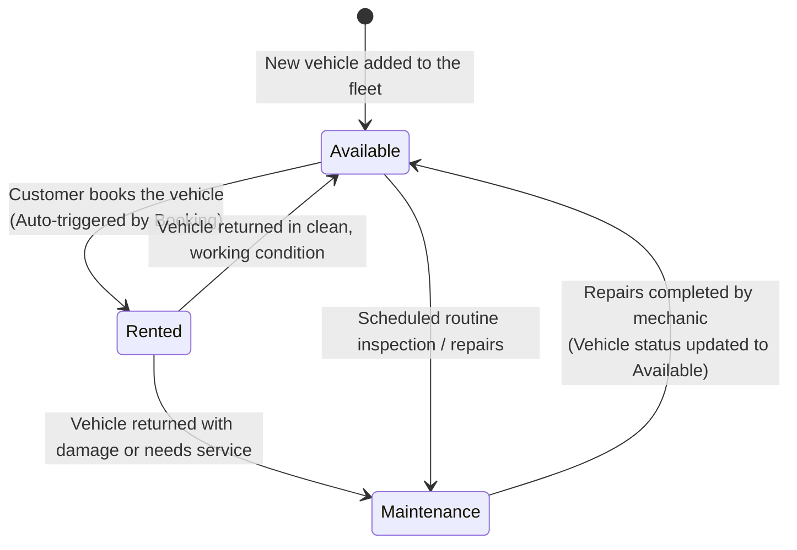
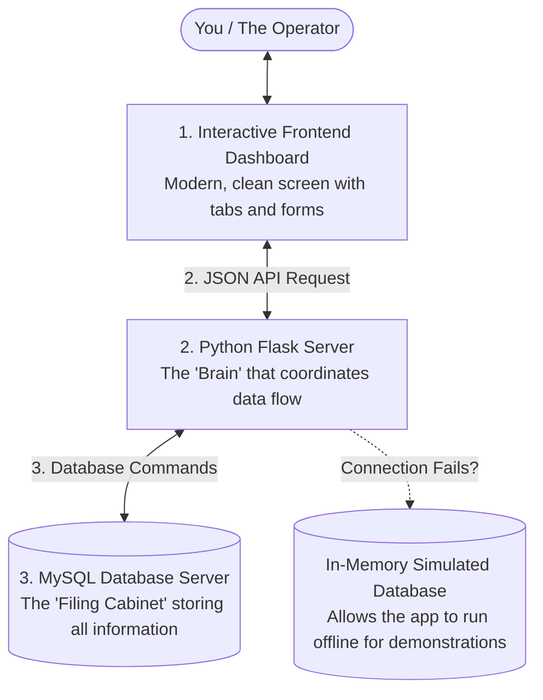
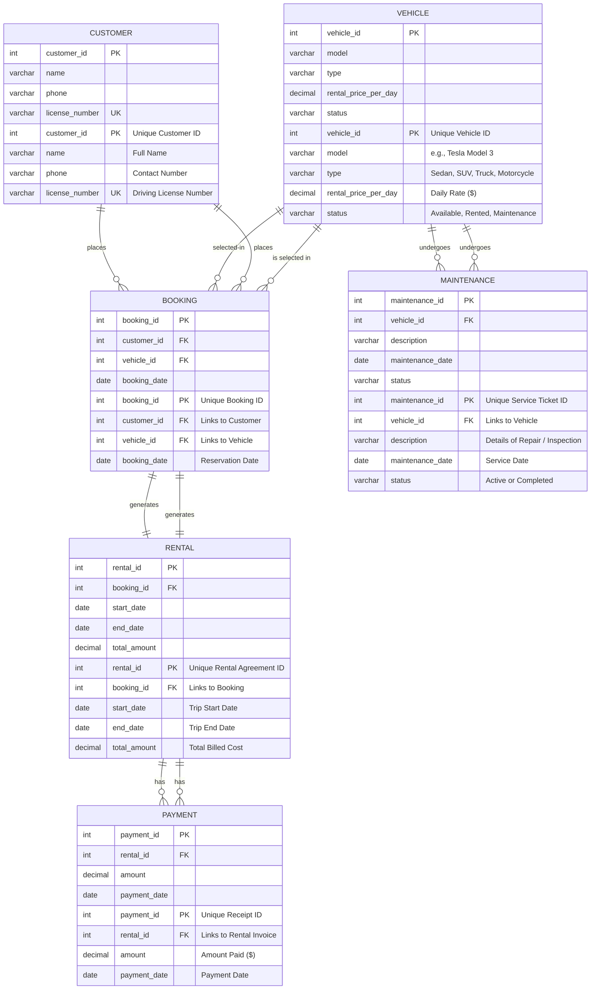
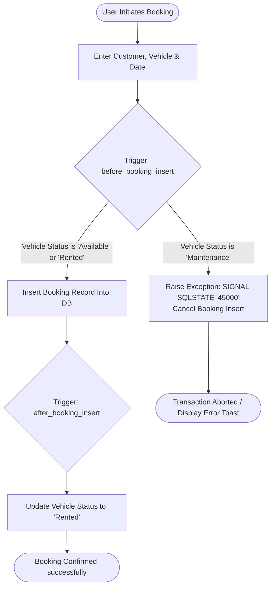

Vehicle Rental System (DBMS-ad034-project)
# 🚗 Vehicle Rental Management System
Welcome to the **Vehicle Rental System**! This is a state-of-the-art Database Management System (DBMS) implementation featuring a secure relational database design (MySQL), an automated transaction layer (Triggers & Stored Procedures), a Python Flask REST API backend, and a premium glassmorphic frontend management console dashboard.
An all-in-one digital platform for managing vehicle rentals. Think of it as a virtual garage and reservation desk combined! It helps rental businesses track customers, manage their fleet of vehicles, handle bookings, process payments, and track vehicle maintenance.
This project includes a **secure relational database (MySQL)**, a **smart automation layer (Triggers & Stored Procedures)**, a **Flask REST API (Backend)**, and an **interactive, modern Dashboard (Frontend)**.
---
## 🏗️ System Architecture
## 🌟 How It Works (For Everyone)
The application is structured as a decoupled three-tier system:
To make it easy to understand, here is how the system handles the typical journey of a customer and a vehicle.
### 1. The Customer's Journey (Step-by-Step)
This flowchart shows exactly what happens from the moment a customer opens the app to rent a vehicle until they return it and complete their payment:
```mermaid
graph TD
    User([User / Administrator]) <--> UI[Premium Glassmorphic Frontend<br>HTML / CSS / JS]
    UI <-->|JSON REST API / AJAX| API[Flask Backend API<br>app.py]
    API <-->|mysql-connector-python| DB[(MySQL Database Server<br>vehicle_rental_db)]
    API -.->|Offline Fallback| MockDB[(In-Memory Mock Database)]
flowchart TD
    Start([1. Customer visits the app]) --> Browse[2. Browse the Fleet Registry]
    Browse --> Select{3. Choose a Vehicle}
    
    Select -->|Vehicle is Available| Book[4. Place a Booking]
    Select -->|Vehicle is in Maintenance| Blocked[4. Booking Blocked!<br>Database trigger prevents booking a car in repair]
    
    Book --> Lock[5. Vehicle Locked<br>Database trigger instantly changes status to 'Rented']
    Lock --> Drive[6. Customer drives and uses the vehicle]
    
    Drive --> Return[7. Customer returns the vehicle]
    Return --> Calc[8. Calculate Bill<br>Stored procedure multiplies daily rate by total days]
    
    Calc --> Pay[9. Process Payment]
    Pay --> Complete([10. Rental Completed!<br>Vehicle returned to 'Available' status])
    
    Blocked --> GoBack[Go back to browse other vehicles]
    GoBack --> Browse
```
> [!NOTE]
> **Database Fallback Mode**
> If the backend fails to connect to the live MySQL server (e.g., wrong credentials, offline database), it automatically falls back to an **In-Memory Simulated Database**. This allows you to demo the interface and operations seamlessly without errors. The connection status indicator in the bottom-left of the app will show either **MySQL Online** (Green) or **Simulated Database** (Yellow).
---
### 2. The Vehicle Life Cycle (Status Transitions)
Vehicles are the core of our business. To ensure we never rent out a car that is currently in use or undergoing maintenance, the database automatically tracks and restricts a vehicle's status using this life cycle:

---
## 📊 Entity-Relationship Diagram (ERD)
### 3. Behind the Scenes (System Architecture)
When you click a button on the screen, here is how the different parts of our application talk to each other:
The database schema models a fully normalized vehicle rental business workflow, using foreign keys, cascading rules, and check constraints.

---
## 📊 Database Schema Design (The Structure)
Our database is designed using 6 separate tables, linked together securely. This layout ensures zero duplicated data and guarantees that if a customer or vehicle is deleted, their corresponding booking histories are cleaned up safely.

### Table Definitions & Attributes
| Table | Primary Key | Foreign Keys | Key Attributes / Constraints | Purpose |
| :--- | :--- | :--- | :--- | :--- |
| **Customer** | `customer_id` | *None* | `license_number` (Unique, Not Null), `phone` | Holds client accounts, contact details, and license verification |
| **Vehicle** | `vehicle_id` | *None* | `status` (Check constraint: `'Available'`, `'Rented'`, `'Maintenance'`) | Inventory registry of active vehicles, types, and daily prices |
| **Booking** | `booking_id` | `customer_id`, `vehicle_id` | Cascade on Delete | Tracks reservations made by customers |
| **Rental** | `rental_id` | `booking_id` | Cascade on Delete | Logs start/end dates and calculates bill totals |
| **Payment** | `payment_id` | `rental_id` | Cascade on Delete | Logs payment transactions and amounts against rentals |
| **Maintenance**| `maintenance_id`| `vehicle_id` | `status` (Check: `'Active'`, `'Completed'`) | Records vehicle damage repairs and blocks them from bookings |
---
## ⚡ Database Automation (Triggers & Procedures)
## ⚙️ Smart Database Automation
### 1. Booking & Status Transition Flowchart
The diagram below shows how the **Triggers** maintain database integrity. 
* **`before_booking_insert`**: Aborts booking if the vehicle is in maintenance.
* **`after_booking_insert`**: Automatically sets the vehicle status to `'Rented'` upon successful booking.
We use database-level automation to enforce rules and calculate prices. This means the rules are enforced directly by the database itself, making the system highly reliable and secure.

### 🛡️ 1. Database Triggers (Automatic Rules)
* **Rule 1: Prevent Renting Damaged Cars (`before_booking_insert`)**  
  If an operator attempts to book a vehicle whose status is currently `'Maintenance'`, the database will block the transaction immediately and display a friendly warning: *“Error: Cannot book this vehicle because it is currently under maintenance!”*
* **Rule 2: Auto-Rent Vehicles (`after_booking_insert`)**  
  As soon as a valid booking is inserted, the database automatically updates that vehicle’s status to `'Rented'`, preventing anybody else from booking it at the same time.
### 2. Rental Billing Calculation Flowchart
The stored procedure `CalculateRentalCharge` automates total cost computations based on rental duration and the daily vehicle price rate:
### 🧮 2. Stored Procedures (Pre-written Calculations)
* **`CalculateRentalCharge`**:  
  Calculates a rental agreement's final bill dynamically:  
  $$\text{Total Charge} = \text{Rental Duration (in Days)} \times \text{Daily Rate of the Vehicle}$$  
  It then updates the `Rental` invoice amount automatically.
* **`GetVehicleAvailabilityReport`**:  
  Aggregates counts of all vehicles in our fleet by their status (`Available`, `Rented`, `Maintenance`), feeding live charts on the dashboard.
$$\text{Total Amount} = \text{DATEDIFF}(\text{end\_date}, \text{start\_date}) \times \text{rental\_price\_per\_day}$$

---
## 🔍 Core SQL Analysis Queries
## 🔍 Predefined Analysis Queries
The system utilizes 10 core queries designed to extract and analyze rental operations:
The system has 10 built-in analytical queries that answer important business questions:
1. **Retrieve all vehicles**: Lists full fleet registry.
   ```sql
   SELECT * FROM Vehicle;
   ```
2. **Display available vehicles**: Filter vehicles ready for rent.
   ```sql
   SELECT * FROM Vehicle WHERE status = 'Available';
   ```
3. **Display rental and customer details (2-table INNER JOIN)**: Combines customer contact info with rental periods.
   ```sql
   SELECT r.rental_id, c.name, c.phone, r.start_date, r.end_date, r.total_amount 
   FROM Rental r 
   INNER JOIN Booking b ON r.booking_id = b.booking_id 
   INNER JOIN Customer c ON b.customer_id = c.customer_id;
   ```
4. **Display rental, customer, and vehicle details (3-table JOIN)**: Consolidated reports linking client, car, and invoice details.
   ```sql
   SELECT r.rental_id, c.name, v.model, v.type, r.start_date, r.end_date, r.total_amount 
   FROM Rental r 
   INNER JOIN Booking b ON r.booking_id = b.booking_id 
   INNER JOIN Customer c ON b.customer_id = c.customer_id 
   INNER JOIN Vehicle v ON b.vehicle_id = v.vehicle_id;
   ```
5. **Count rentals per vehicle type (GROUP BY)**: Aggregates total business demand metrics by category.
   ```sql
   SELECT v.type, COUNT(r.rental_id) AS total_rentals 
   FROM Rental r 
   INNER JOIN Booking b ON r.booking_id = b.booking_id 
   INNER JOIN Vehicle v ON b.vehicle_id = v.vehicle_id 
   GROUP BY v.type;
   ```
6. **Display vehicle types having more than 15 rentals (HAVING)**: Filters high-demand rental categories.
   ```sql
   SELECT v.type, COUNT(r.rental_id) AS total_rentals 
   FROM Rental r 
   INNER JOIN Booking b ON r.booking_id = b.booking_id 
   INNER JOIN Vehicle v ON b.vehicle_id = v.vehicle_id 
   GROUP BY v.type 
   HAVING COUNT(r.rental_id) > 15;
   ```
7. **Retrieve vehicles whose rental charge is greater than the average (Subquery)**: Extracts premium-tier inventory.
   ```sql
   SELECT * FROM Vehicle WHERE rental_price_per_day > (SELECT AVG(rental_price_per_day) FROM Vehicle);
   ```
8. **Retrieve customers who rented more than customer 2 (Correlated Subquery)**: Identifies high-value accounts compared to a specific benchmark.
   ```sql
   SELECT c1.customer_id, c1.name, (SELECT COUNT(*) FROM Booking b1 WHERE b1.customer_id = c1.customer_id) AS booking_count 
   FROM Customer c1 
   WHERE (SELECT COUNT(*) FROM Booking b1 WHERE b1.customer_id = c1.customer_id) > (SELECT COUNT(*) FROM Booking b2 WHERE b2.customer_id = 2);
   ```
9. **Display all vehicles including unrented (LEFT JOIN)**: Full audit of fleet asset occupancy.
   ```sql
   SELECT v.vehicle_id, v.model, v.type, v.status, b.booking_id, b.booking_date 
   FROM Vehicle v LEFT JOIN Booking b ON v.vehicle_id = b.vehicle_id;
   ```
10. **Retrieve vehicles never rented (NOT EXISTS)**: Lists inactive assets for scheduling maintenance or sales.
    ```sql
    SELECT * FROM Vehicle v WHERE NOT EXISTS (SELECT 1 FROM Booking b WHERE b.vehicle_id = v.vehicle_id);
    ```
| Query # | Question Answered | SQL Implementation |
| :---: | :--- | :--- |
| **1** | What vehicles do we own? | `SELECT * FROM Vehicle;` |
| **2** | Which vehicles are ready to rent right now? | `SELECT * FROM Vehicle WHERE status = 'Available';` |
| **3** | Who rented what, and when? (2-Table Join) | Combines `Rental` and `Customer` details. |
| **4** | Can we get a complete history of customer details, vehicles, and charges? (3-Table Join) | Joins `Rental`, `Customer`, and `Vehicle` tables. |
| **5** | Which types of vehicles (Sedans, SUVs, etc.) are rented most? | `GROUP BY v.type` to count total rentals per vehicle type. |
| **6** | Which vehicle types have high demand (>15 rentals)? | Groups by type and filters using `HAVING COUNT(r.rental_id) > 15`. |
| **7** | Which vehicles cost more than our average fleet rental price? | Subquery: compares rates against `(SELECT AVG(price) FROM Vehicle)`. |
| **8** | Which power-users have booked more vehicles than Customer ID 2? | Correlated Subquery: compares customer booking counts. |
| **9** | List all vehicles, showing booking details even if they have never been rented. | `LEFT JOIN` on vehicle bookings. |
| **10** | Which vehicles are inactive/idle and have never been rented? | `NOT EXISTS` query to identify vehicles with zero booking history. |
---
## 🛠️ API & Endpoint Documentation
## 🎨 Interactive Features in the Dashboard
The Flask server (`backend/app.py`) serves the static frontend and exposes clean JSON API endpoints:
Our management dashboard is packed with features designed to make administration effortless:
* **`GET /api/config`**: Gets current MySQL connection state and active database configurations.
* **`POST /api/config`**: Dynamically updates database connection details in real-time.
* **`GET /api/customers` | `POST /api/customers` | `PUT /api/customers/<id>` | `DELETE /api/customers/<id>`**: Full CRUD endpoints for customers.
* **`GET /api/vehicles` | `POST /api/vehicles` | `PUT /api/vehicles/<id>` | `DELETE /api/vehicles/<id>`**: Full CRUD endpoints for the vehicle inventory.
* **`GET /api/bookings` | `POST /api/bookings` | `DELETE /api/bookings/<id>`**: Places bookings (and triggers automated database updates).
* **`GET /api/rentals`**: Returns rental agreement structures.
* **`POST /api/procedures/calculate-charge`**: Calls the `CalculateRentalCharge` stored procedure.
* **`POST /api/query`**: Runs custom or predefined queries from the SQL Workbench in a secure execution sandbox.
1. **Live Analytics Dashboard**: Look at current stats (total customers, bookings, active fleet count) and a beautiful chart of your vehicle distribution.
2. **Interactive Workbench**: Run any of the 10 built-in SQL analysis queries with one click and see the results instantly formatted as a table.
3. **Database Configuration Panel**: Click the settings slider in the sidebar to change the MySQL database username, password, hostname, or port dynamically without restarting the server!
---
## 🚀 Setup & Execution
## 🚀 Setup & Installation (Technical)
### Prerequisites
* **Python 3.x** installed.
* **MySQL 8.x** server running locally.
### Step 1: Initialize Database
Login to your MySQL terminal and run the schema script:
### Step 1: Set Up MySQL Schema & Seeding
Open your Command Prompt (CMD) or MySQL Workbench and execute:
```sql
CREATE DATABASE vehicle_rental_db;
USE vehicle_rental_db;
SOURCE C:/Users/Rakshitha/.gemini/antigravity-ide/scratch/DBMS-ad034-project/database/schema.sql;
```
### Step 2: Launch Backend Server
Install required Python dependencies and run the backend:
### Step 2: Run the Application Server
Run the following commands in your terminal to install dependencies and run the server:
```bash
pip install flask mysql-connector-python
python backend/app.py
```
### Step 3: Open Dashboard UI
Navigate to [http://127.0.0.1:5000](http://127.0.0.1:5000) in your web browser. 
### Step 3: Open the Management App
Open your web browser and navigate to:  
👉 **[http://127.0.0.1:5000/](http://127.0.0.1:5000/)**
---
## 🛡️ License
Distributed under the MIT License. Created for the DBMS Project Course (ad034).
