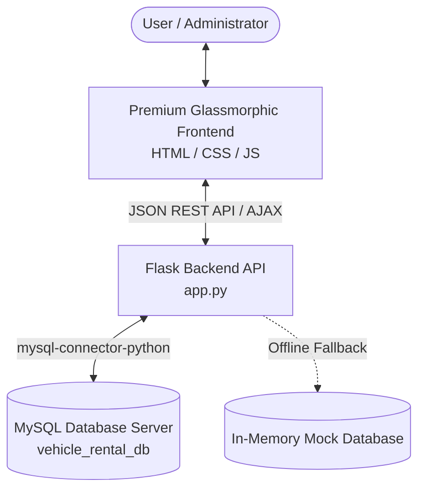
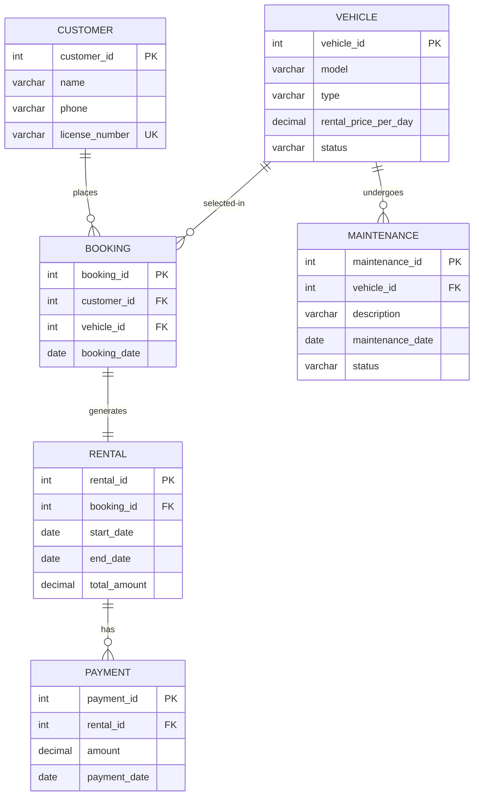
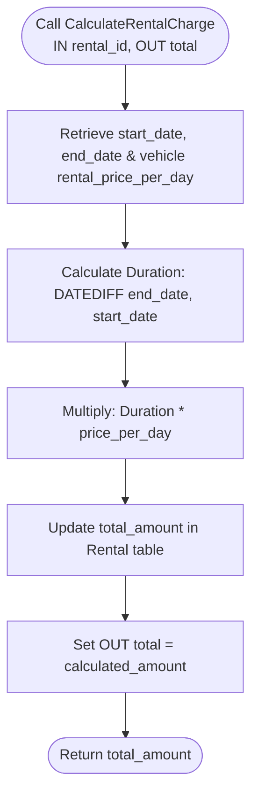

# Vehicle Rental System (DBMS-ad034-project)

Welcome to the **Vehicle Rental System**! This is a state-of-the-art Database Management System (DBMS) implementation featuring a secure relational database design (MySQL), an automated transaction layer (Triggers & Stored Procedures), a Python Flask REST API backend, and a premium glassmorphic frontend management console dashboard.

---

## 🏗️ System Architecture

The application is structured as a decoupled three-tier system:



> [!NOTE]
> **Database Fallback Mode**
> If the backend fails to connect to the live MySQL server (e.g., wrong credentials, offline database), it automatically falls back to an **In-Memory Simulated Database**. This allows you to demo the interface and operations seamlessly without errors. The connection status indicator in the bottom-left of the app will show either **MySQL Online** (Green) or **Simulated Database** (Yellow).

---

## 📊 Entity-Relationship Diagram (ERD)

The database schema models a fully normalized vehicle rental business workflow, using foreign keys, cascading rules, and check constraints.



### Table Definitions & Attributes

| Table | Primary Key | Foreign Keys | Key Attributes / Constraints | Purpose |
| :--- | :--- | :--- | :--- | :--- |
| **Customer** | `customer_id` | *None* | `license_number` (Unique, Not Null), `phone` | Holds client accounts, contact details, and license verification |
| **Vehicle** | `vehicle_id` | *None* | `status` (Check constraint: `'Available'`, `'Rented'`, `'Maintenance'`) | Inventory registry of active vehicles, types, and daily prices |
| **Booking** | `booking_id` | `customer_id`, `vehicle_id` | Cascade on Delete | Tracks reservations made by customers |
| **Rental** | `rental_id` | `booking_id` | Cascade on Delete | Logs start/end dates and calculates bill totals |
| **Payment** | `payment_id` | `rental_id` | Cascade on Delete | Logs payment transactions and amounts against rentals |
| **Maintenance**| `maintenance_id`| `vehicle_id` | `status` (Check: `'Active'`, `'Completed'`) | Records vehicle damage repairs and blocks them from bookings |

---

## ⚡ Database Automation (Triggers & Procedures)

### 1. Booking & Status Transition Flowchart
The diagram below shows how the **Triggers** maintain database integrity. 
* **`before_booking_insert`**: Aborts booking if the vehicle is in maintenance.
* **`after_booking_insert`**: Automatically sets the vehicle status to `'Rented'` upon successful booking.


### 2. Rental Billing Calculation Flowchart
The stored procedure `CalculateRentalCharge` automates total cost computations based on rental duration and the daily vehicle price rate:

$$\text{Total Amount} = \text{DATEDIFF}(\text{end\_date}, \text{start\_date}) \times \text{rental\_price\_per\_day}$$



---

## 🔍 Core SQL Analysis Queries

The system utilizes 10 core queries designed to extract and analyze rental operations:

1. **Retrieve all vehicles**: Lists full fleet registry.
   ```sql
   SELECT * FROM Vehicle;
   ```
2. **Display available vehicles**: Filter vehicles ready for rent.
   ```sql
   SELECT * FROM Vehicle WHERE status = 'Available';
   ```
3. **Display rental and customer details (2-table INNER JOIN)**: Combines customer contact info with rental periods.
   ```sql
   SELECT r.rental_id, c.name, c.phone, r.start_date, r.end_date, r.total_amount 
   FROM Rental r 
   INNER JOIN Booking b ON r.booking_id = b.booking_id 
   INNER JOIN Customer c ON b.customer_id = c.customer_id;
   ```
4. **Display rental, customer, and vehicle details (3-table JOIN)**: Consolidated reports linking client, car, and invoice details.
   ```sql
   SELECT r.rental_id, c.name, v.model, v.type, r.start_date, r.end_date, r.total_amount 
   FROM Rental r 
   INNER JOIN Booking b ON r.booking_id = b.booking_id 
   INNER JOIN Customer c ON b.customer_id = c.customer_id 
   INNER JOIN Vehicle v ON b.vehicle_id = v.vehicle_id;
   ```
5. **Count rentals per vehicle type (GROUP BY)**: Aggregates total business demand metrics by category.
   ```sql
   SELECT v.type, COUNT(r.rental_id) AS total_rentals 
   FROM Rental r 
   INNER JOIN Booking b ON r.booking_id = b.booking_id 
   INNER JOIN Vehicle v ON b.vehicle_id = v.vehicle_id 
   GROUP BY v.type;
   ```
6. **Display vehicle types having more than 15 rentals (HAVING)**: Filters high-demand rental categories.
   ```sql
   SELECT v.type, COUNT(r.rental_id) AS total_rentals 
   FROM Rental r 
   INNER JOIN Booking b ON r.booking_id = b.booking_id 
   INNER JOIN Vehicle v ON b.vehicle_id = v.vehicle_id 
   GROUP BY v.type 
   HAVING COUNT(r.rental_id) > 15;
   ```
7. **Retrieve vehicles whose rental charge is greater than the average (Subquery)**: Extracts premium-tier inventory.
   ```sql
   SELECT * FROM Vehicle WHERE rental_price_per_day > (SELECT AVG(rental_price_per_day) FROM Vehicle);
   ```
8. **Retrieve customers who rented more than customer 2 (Correlated Subquery)**: Identifies high-value accounts compared to a specific benchmark.
   ```sql
   SELECT c1.customer_id, c1.name, (SELECT COUNT(*) FROM Booking b1 WHERE b1.customer_id = c1.customer_id) AS booking_count 
   FROM Customer c1 
   WHERE (SELECT COUNT(*) FROM Booking b1 WHERE b1.customer_id = c1.customer_id) > (SELECT COUNT(*) FROM Booking b2 WHERE b2.customer_id = 2);
   ```
9. **Display all vehicles including unrented (LEFT JOIN)**: Full audit of fleet asset occupancy.
   ```sql
   SELECT v.vehicle_id, v.model, v.type, v.status, b.booking_id, b.booking_date 
   FROM Vehicle v LEFT JOIN Booking b ON v.vehicle_id = b.vehicle_id;
   ```
10. **Retrieve vehicles never rented (NOT EXISTS)**: Lists inactive assets for scheduling maintenance or sales.
    ```sql
    SELECT * FROM Vehicle v WHERE NOT EXISTS (SELECT 1 FROM Booking b WHERE b.vehicle_id = v.vehicle_id);
    ```

---

## 🛠️ API & Endpoint Documentation

The Flask server (`backend/app.py`) serves the static frontend and exposes clean JSON API endpoints:

* **`GET /api/config`**: Gets current MySQL connection state and active database configurations.
* **`POST /api/config`**: Dynamically updates database connection details in real-time.
* **`GET /api/customers` | `POST /api/customers` | `PUT /api/customers/<id>` | `DELETE /api/customers/<id>`**: Full CRUD endpoints for customers.
* **`GET /api/vehicles` | `POST /api/vehicles` | `PUT /api/vehicles/<id>` | `DELETE /api/vehicles/<id>`**: Full CRUD endpoints for the vehicle inventory.
* **`GET /api/bookings` | `POST /api/bookings` | `DELETE /api/bookings/<id>`**: Places bookings (and triggers automated database updates).
* **`GET /api/rentals`**: Returns rental agreement structures.
* **`POST /api/procedures/calculate-charge`**: Calls the `CalculateRentalCharge` stored procedure.
* **`POST /api/query`**: Runs custom or predefined queries from the SQL Workbench in a secure execution sandbox.

---

## 🚀 Setup & Execution

### Prerequisites
* **Python 3.x** installed.
* **MySQL 8.x** server running locally.

### Step 1: Initialize Database
Login to your MySQL terminal and run the schema script:
```sql
CREATE DATABASE vehicle_rental_db;
USE vehicle_rental_db;
SOURCE C:/Users/Rakshitha/.gemini/antigravity-ide/scratch/DBMS-ad034-project/database/schema.sql;
```

### Step 2: Launch Backend Server
Install required Python dependencies and run the backend:
```bash
pip install flask mysql-connector-python
python backend/app.py
```

### Step 3: Open Dashboard UI
Navigate to [http://127.0.0.1:5000](http://127.0.0.1:5000) in your web browser. 

---

## 🛡️ License
Distributed under the MIT License. Created for the DBMS Project Course (ad034).
