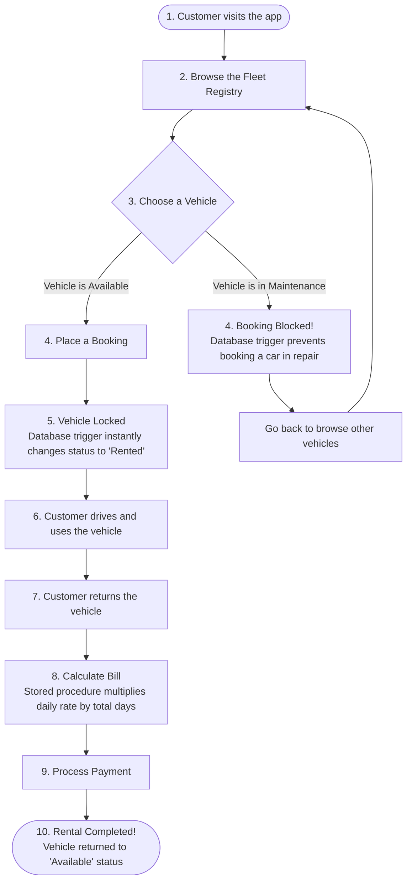
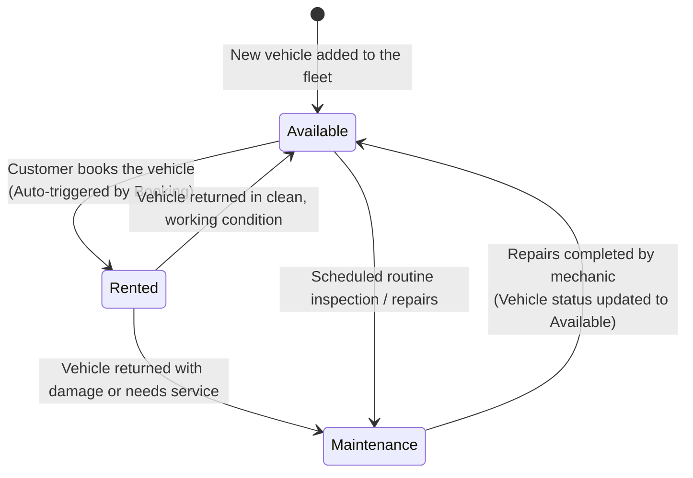
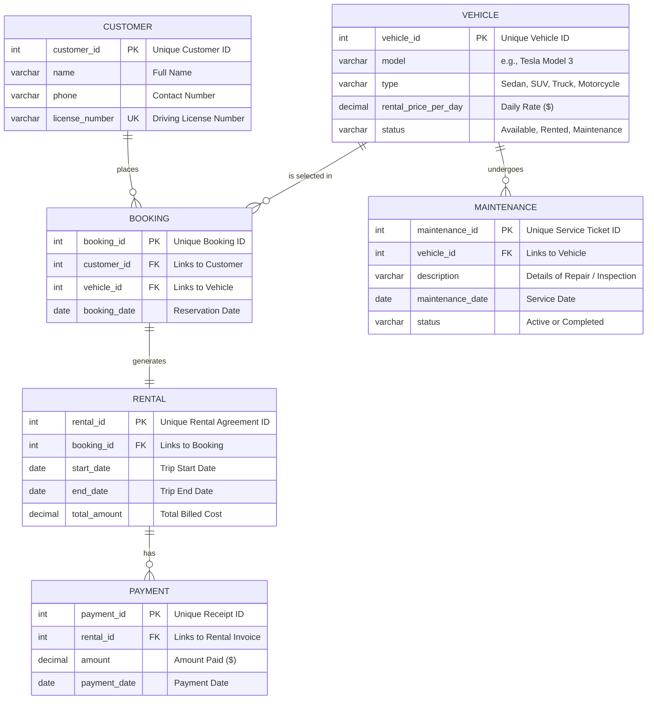

# 🚗 Vehicle Rental Management System

An all-in-one digital platform for managing vehicle rentals. Think of it as a virtual garage and reservation desk combined! It helps rental businesses track customers, manage their fleet of vehicles, handle bookings, process payments, and track vehicle maintenance.

This project includes a **secure relational database (MySQL)**, a **smart automation layer (Triggers & Stored Procedures)**, a **Flask REST API (Backend)**, and an **interactive, modern Dashboard (Frontend)**.

---

## 🌟 How It Works (For Everyone)

To make it easy to understand, here is how the system handles the typical journey of a customer and a vehicle.

### 1. The Customer's Journey (Step-by-Step)
This flowchart shows exactly what happens from the moment a customer opens the app to rent a vehicle until they return it and complete their payment:



---

### 2. The Vehicle Life Cycle (Status Transitions)
Vehicles are the core of our business. To ensure we never rent out a car that is currently in use or undergoing maintenance, the database automatically tracks and restricts a vehicle's status using this life cycle:



---

### 3. Behind the Scenes (System Architecture)
When you click a button on the screen, here is how the different parts of our application talk to each other:


---

## 📊 Database Schema Design (The Structure)

Our database is designed using 6 separate tables, linked together securely. This layout ensures zero duplicated data and guarantees that if a customer or vehicle is deleted, their corresponding booking histories are cleaned up safely.



---

## ⚙️ Smart Database Automation

We use database-level automation to enforce rules and calculate prices. This means the rules are enforced directly by the database itself, making the system highly reliable and secure.

### 🛡️ 1. Database Triggers (Automatic Rules)
* **Rule 1: Prevent Renting Damaged Cars (`before_booking_insert`)**  
  If an operator attempts to book a vehicle whose status is currently `'Maintenance'`, the database will block the transaction immediately and display a friendly warning: *“Error: Cannot book this vehicle because it is currently under maintenance!”*
* **Rule 2: Auto-Rent Vehicles (`after_booking_insert`)**  
  As soon as a valid booking is inserted, the database automatically updates that vehicle’s status to `'Rented'`, preventing anybody else from booking it at the same time.

### 🧮 2. Stored Procedures (Pre-written Calculations)
* **`CalculateRentalCharge`**:  
  Calculates a rental agreement's final bill dynamically:  
  $$\text{Total Charge} = \text{Rental Duration (in Days)} \times \text{Daily Rate of the Vehicle}$$  
  It then updates the `Rental` invoice amount automatically.
* **`GetVehicleAvailabilityReport`**:  
  Aggregates counts of all vehicles in our fleet by their status (`Available`, `Rented`, `Maintenance`), feeding live charts on the dashboard.

---

## 🔍 Predefined Analysis Queries

The system has 10 built-in analytical queries that answer important business questions:

| Query # | Question Answered | SQL Implementation |
| :---: | :--- | :--- |
| **1** | What vehicles do we own? | `SELECT * FROM Vehicle;` |
| **2** | Which vehicles are ready to rent right now? | `SELECT * FROM Vehicle WHERE status = 'Available';` |
| **3** | Who rented what, and when? (2-Table Join) | Combines `Rental` and `Customer` details. |
| **4** | Can we get a complete history of customer details, vehicles, and charges? (3-Table Join) | Joins `Rental`, `Customer`, and `Vehicle` tables. |
| **5** | Which types of vehicles (Sedans, SUVs, etc.) are rented most? | `GROUP BY v.type` to count total rentals per vehicle type. |
| **6** | Which vehicle types have high demand (>15 rentals)? | Groups by type and filters using `HAVING COUNT(r.rental_id) > 15`. |
| **7** | Which vehicles cost more than our average fleet rental price? | Subquery: compares rates against `(SELECT AVG(price) FROM Vehicle)`. |
| **8** | Which power-users have booked more vehicles than Customer ID 2? | Correlated Subquery: compares customer booking counts. |
| **9** | List all vehicles, showing booking details even if they have never been rented. | `LEFT JOIN` on vehicle bookings. |
| **10** | Which vehicles are inactive/idle and have never been rented? | `NOT EXISTS` query to identify vehicles with zero booking history. |

---

## 🎨 Interactive Features in the Dashboard

Our management dashboard is packed with features designed to make administration effortless:

1. **Live Analytics Dashboard**: Look at current stats (total customers, bookings, active fleet count) and a beautiful chart of your vehicle distribution.
2. **Interactive Workbench**: Run any of the 10 built-in SQL analysis queries with one click and see the results instantly formatted as a table.
3. **Database Configuration Panel**: Click the settings slider in the sidebar to change the MySQL database username, password, hostname, or port dynamically without restarting the server!

---

## 🚀 Setup & Installation (Technical)

### Prerequisites
* **Python 3.x** installed.
* **MySQL 8.x** server running locally.

### Step 1: Set Up MySQL Schema & Seeding
Open your Command Prompt (CMD) or MySQL Workbench and execute:
```sql
CREATE DATABASE vehicle_rental_db;
USE vehicle_rental_db;
SOURCE C:/Users/Rakshitha/.gemini/antigravity-ide/scratch/DBMS-ad034-project/database/schema.sql;
```

### Step 2: Run the Application Server
Run the following commands in your terminal to install dependencies and run the server:
```bash
pip install flask mysql-connector-python
python backend/app.py
```

### Step 3: Open the Management App
Open your web browser and navigate to:  
👉 **[http://127.0.0.1:5000/](http://127.0.0.1:5000/)**
